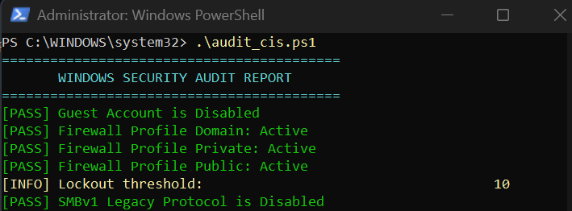
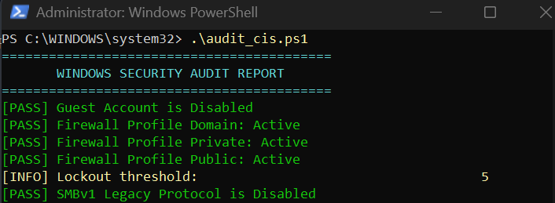

# Windows 11 Security Auditing & CIS Benchmarks Hardening

## Project Overview
This project demonstrates an automated security audit and system hardening implementation on Windows 11 based on **CIS (Center for Internet Security) Benchmarks**. The goal was to identify configuration drift, enforce strict password/lockout policies, and minimize local attack surfaces.

## Key Hardening Directives Applied
* **Account Lockout Policy:** Configured a threshold of 5 failed attempts with a 15-minute lockout duration to prevent brute-force attacks.
* **Guest Account Security:** Enforced strict status validation to ensure the default Guest account remains disabled.
* **Firewall Enforcement:** Audited Domain, Private, and Public profiles to guarantee active state enforcement.
* **Legacy Protocols:** Verified full mitigation of legacy SMBv1 protocols to mitigate lateral movement vectors.

## Execution & Verification

### 1. Initial Security Audit

*Figure 1: Baseline PowerShell audit script output identifying configuration gaps.*

### 2. Hardening Remediation Result

*Figure 2: Verified compliance showing active Account Lockout controls and hardened security posture.*

## Key Competencies Demonstrated
* **System Hardening:** Translating compliance frameworks (CIS Benchmarks) into actionable system policies.
* **PowerShell Automation:** Authoring lightweight security auditing tools for fast baseline assessments.
* **Attack Surface Reduction:** Mitigating credential dumping and brute-force vulnerabilities on Windows endpoints.
